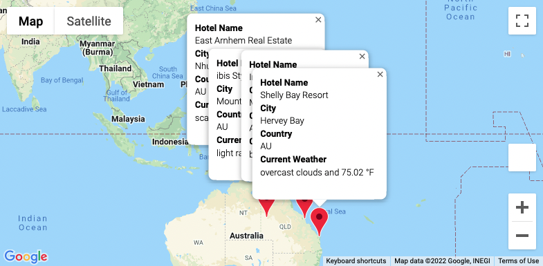

# Travel Planning Using Weather Data

## Overview
The purpose of this project was to create a product that can be used to identify potential travel destinations and nearby hotels based on a user’s weather preferences. The product can also be used to create a travel itinerary between selected destinations. 

## Project Components

### Destination Weather Database
A [Python script using Pandas in Jupyter Notebook](Weather_Database/Weather_Database.ipynb) was developed to create a set of random latitude and longitude combinations, from which nearly 700 cities were identified. Weather data for these cities were obtained using the OpenWeatherMap API and stored in a [destination weather database CSV file](Weather_Database/WeatherPy_Database.csv). 

### Destination Search
A [Python script using Pandas in Jupyter Notebook]( Vacation_Search/Vacation_Search.ipynb) was developed to allow users to enter their desired minimum and maximum temperature criteria for a travel destination. The script identifies the subset of travel destinations meeting the user’s temperature preferences and finds nearby hotels using the Google Maps API. Potential travel destinations and hotels based on temperature criteria of 75-90 °F were identified and saved to a [CSV file]( Vacation_Search/WeatherPy_Vacation.csv) as an example. Below is an example of the map with markers created from these data using the Google Maps API.

 

### Travel Itinerary
A final [Python script using Pandas in Jupyter Notebook]( Vacation_Itinerary/Vacation_Itinerary.ipynb) was developed to select the final travel destinations and create a map of the route between them using the Google Maps API. Below are an example of the map displaying the route and an example of the map displaying markers for the selected destinations.

